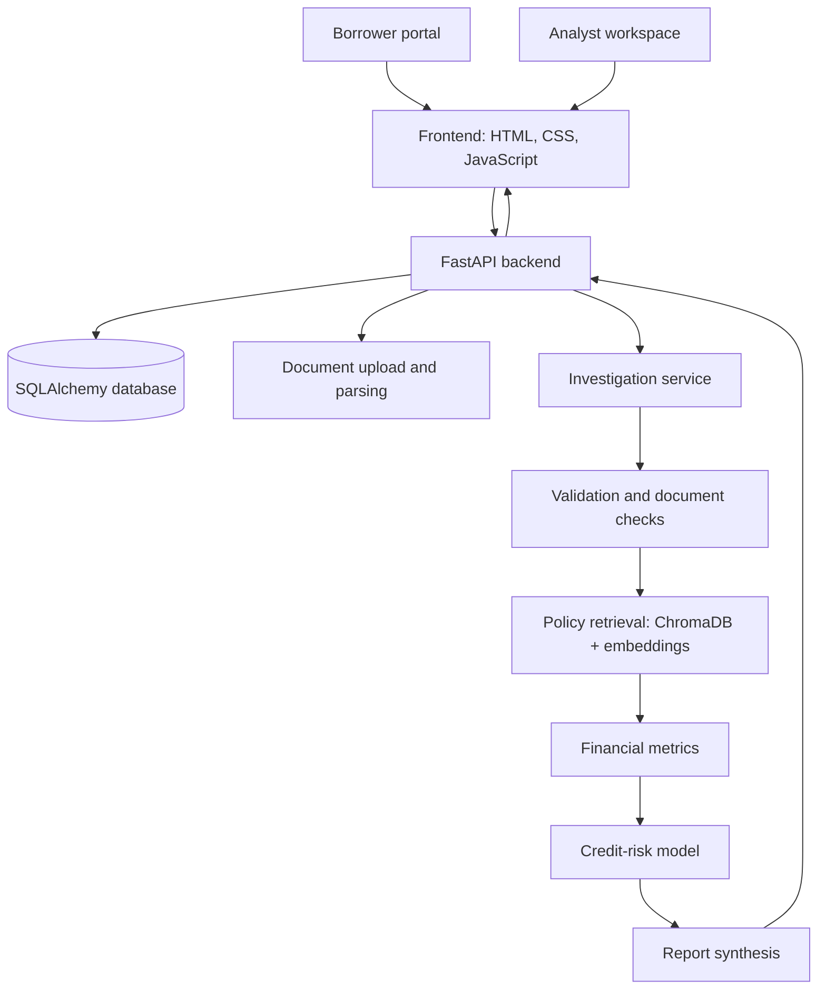
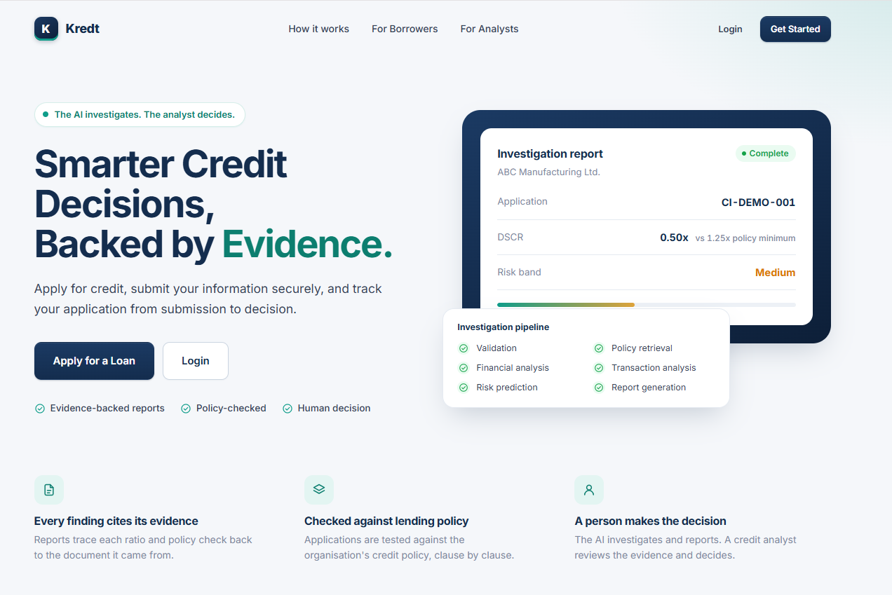

# Kredt — AI-Assisted Credit Intelligence

**TAG AI Engineering Bootcamp · Cohort 1 · Team Tunners · Project 3**

> **The AI investigates. The analyst decides.**

Kredt is a credit-intelligence prototype designed to support loan application review. It brings borrower onboarding and application handling together with financial analysis, policy checks, machine-learning risk scoring, document review, and an investigation report for human analysts.

The system is intended to make the evidence behind an assessment easier to inspect—not to replace an analyst's judgement or make autonomous lending decisions.

## Live application

- **Live demo:** [Launch Kredt Web Application](https://c1-tuners-project-3-frontend.vercel.app)
- **Backend API:** [Kredt API](https://kredt-backend-api.agreeabletree-ad7aebd5.westus2.azurecontainerapps.io)
- **API documentation:** [Interactive API docs](https://kredt-backend-api.agreeabletree-ad7aebd5.westus2.azurecontainerapps.io/docs)
- **Health check:** [`/health`](https://kredt-backend-api.agreeabletree-ad7aebd5.westus2.azurecontainerapps.io/health)

Deployment availability and configuration can change. The API documentation is the best place to inspect the routes exposed by the deployed backend.

## The problem

Credit assessment can require reviewers to move between applicant information, financial calculations, policy requirements, supporting documents, and risk signals. That fragmentation makes it harder to trace why an application was flagged or recommended for further review.

Kredt explores a unified workflow in which application data is validated, relevant policy information is retrieved, financial and credit-risk analyses are run, and the findings are assembled into a report that a human analyst can review.

## Product workflow

1. **Submit an application.** A borrower provides applicant details, loan information, and financial information.
2. **Review supporting documents.** Documents can be uploaded and associated with an application.
3. **Run an investigation.** The backend creates an investigation job and executes the configured analysis pipeline.
4. **Inspect the evidence.** The pipeline produces policy findings, financial metrics, a credit-risk score and band, transaction findings, and a report where the relevant components return those outputs.
5. **Make a human decision.** The analyst reviews the available evidence and records the lending assessment through the analyst workflow.

The implementation is a prototype, and not every stage is backed by a complete production-grade data source. See [Implementation status and limitations](#implementation-status-and-limitations).

## Key capabilities

### Borrower application workflow

The frontend includes borrower-facing application pages and profile screens. The backend exposes endpoints for creating and retrieving applications, with structured request and response schemas.

### Analyst workspace

The frontend includes an analyst dashboard and application queue, application details, document views, investigation progress, report views, assessment screens, and an audit-oriented view. The interface is built with plain HTML, CSS, and JavaScript; it does not require a frontend build framework.

### Financial analysis

The financial-analysis module calculates five metrics from the supplied financial and loan data:

- **Net profit margin** — net income divided by revenue.
- **Debt-to-revenue** — outstanding debt divided by annual revenue.
- **Debt-service coverage ratio (DSCR)** — monthly net income divided by existing monthly debt payments in this implementation.
- **Loan-to-annual-revenue** — requested loan amount divided by annual revenue.
- **Expense ratio** — operating expenses divided by revenue.

The module returns calculation expressions alongside values to support inspection. DSCR uses monthly net income as a simplified cash-flow proxy because the current input contract does not provide a complete projected cash-flow and debt-service schedule. When existing monthly debt service is zero, DSCR is returned as `null` rather than dividing by zero.

### Credit-risk model

The risk-model module uses the Home Credit Default Risk competition's application data. It filters to `Cash loans`, uses the dataset's `TARGET` outcome, engineers a fixed set of 12 applicant features, and compares a Logistic Regression baseline with a HistGradientBoosting classifier. The selected model is saved as a versioned artefact and exposed through a prediction function.

The model returns a score under the API-compatible field name `probability_of_default` and assigns a relative `LOW`, `MEDIUM`, or `HIGH` risk band. In this dataset, `TARGET` represents the observed payment-difficulty outcome; it should not be interpreted as a universal default probability or as a prediction over a validated time horizon.

Reported held-out evaluation in the model module's documentation:

| Model | ROC-AUC | PR-AUC | Brier score |
|---|---:|---:|---:|
| Logistic Regression baseline | 0.6392 | 0.1384 | 0.2356 |
| HistGradientBoosting classifier | 0.6483 | 0.1449 | 0.0747 |

These are results reported for the project's Home Credit evaluation—not evidence of performance on Kredt's intended borrower population.

### Policy retrieval and investigation orchestration

The repository contains a LangGraph pipeline with sequential stages for validation, policy retrieval, financial analysis, credit-risk prediction, and report synthesis. The policy module indexes the local credit-policy markdown file in ChromaDB using sentence-transformer embeddings. The report-generation node can call a Groq-hosted language model when its API key is configured and contains fallback reporting logic.

### Document handling

The backend exposes document-upload and application-document listing endpoints. The investigation validation code includes document parsing and an LLM-assisted verification path. Actual results depend on the uploaded material, parser output, configured credentials, and the live environment; document verification should not be assumed accurate without review.

## System architecture



The graph above describes the intended code-level investigation flow. The separate `ai-ml-backbone/ai_agent` package also contains an agent orchestrator; its README explicitly marks policy checking and transaction analysis as temporary mock components. The live integration path and the standalone agent package should therefore not be assumed to have identical stage implementations.

## Technology stack

| Area | Technologies in the repository |
|---|---|
| Frontend | HTML, CSS, JavaScript |
| API | Python, FastAPI, Pydantic, Uvicorn |
| Persistence | SQLAlchemy; SQLite by default, with `DATABASE_URL` configuration support |
| ML and data processing | pandas, NumPy, scikit-learn, joblib |
| Investigation workflow | LangGraph |
| Policy retrieval | ChromaDB, Sentence Transformers, LangChain text splitters |
| Report generation / document checks | Groq API integration; configuration-dependent |
| Packaging and deployment | Docker, GitHub Actions, Azure Container Registry / Azure Container Apps configuration |

## Repository layout

```text
c1-tuners-project-3/
├── ai/                              # LangGraph investigation pipeline and nodes
│   ├── knowledge_base/              # Credit policy source document
│   └── nodes/                       # Validation, policy, finance, risk, reporting
├── ai-ml-backbone/
│   ├── ai_agent/                    # Investigation agent and integration adapters
│   ├── financial_analysis/          # Auditable financial metric calculator
│   └── risk_model/                  # Feature engineering, training, inference, tests
├── backend/
│   └── app/
│       ├── models/                  # Database models
│       ├── routers/                 # Application, document, investigation endpoints
│       └── services/                # Investigation orchestration
├── frontend/                        # Borrower and analyst application
├── scripts/                         # Demo-data seeding utility
├── Dockerfile                       # Backend container configuration
├── requirements.txt                 # Python dependency pins
└── test_ai_graph.py                 # Investigation graph test entry point
```

## API surface

The FastAPI application mounts its routers under `/api/v1` and exposes a health endpoint at `/health`. The implemented route groups include:

| Area | Routes |
|---|---|
| Applications | `POST /api/v1/applications`, `GET /api/v1/applications`, `GET /api/v1/applications/{application_id}` |
| Documents | `POST /api/v1/documents/upload`, `GET /api/v1/documents/application/{application_id}` |
| Investigations | Trigger investigation, check job status, and retrieve results by application or investigation ID |

Consult the live [Swagger UI](https://kredt-backend-api.agreeabletree-ad7aebd5.westus2.azurecontainerapps.io/docs) for exact parameters, schemas, and current deployed behaviour.

## Implementation status and limitations

Kredt combines implemented modules with components that remain partial, mocked, or dependent on external configuration. Important limitations documented in the code include:

- **Population transfer:** the credit-risk model was trained on Home Credit data, not on a representative sample of Kredt's intended applicant population. The model requires local validation before any operational lending use.
- **Risk interpretation:** the model's score is tied to the Home Credit payment-difficulty target. Its risk bands are relative reference-population rankings, not approval thresholds.
- **Transaction analysis:** the standalone AI agent's transaction-analysis adapter currently returns a hard-coded mock finding. Do not treat that output as analysis of a borrower's actual transactions.
- **Policy checks:** the standalone AI agent documents its policy-checking adapter as temporary mock logic. The LangGraph pipeline has a separate policy-retrieval implementation; these are distinct paths.
- **LLM dependency:** report synthesis and document checks can depend on external model credentials and network availability. Fallback logic exists for some report-generation failures.
- **Privacy and security:** this is a development prototype, not a certification of production security, privacy compliance, or lending-model fairness.

For these reasons, Kredt should be treated as an engineering prototype and decision-support demonstration—not as an autonomous credit-approval system.

## Testing

The repository includes focused tests for the financial calculator, risk model, agent, and investigation graph. Relevant test files include:

- `ai-ml-backbone/financial_analysis/test_calculator.py`
- `ai-ml-backbone/risk_model/tests/test_risk_model.py`
- `ai-ml-backbone/ai_agent/test_agent.py`
- `test_ai_graph.py`


## Screenshots

### Kredt Homepage


## Team

Team Tunners · TAG AI Engineering Bootcamp, Cohort 1

- John Confidence Bello — Team Lead
- Fawaz Bello
- Oyetunji Shukrah
- Emmanuel Akanbi
- Adeniran Treasure

## Responsible-use note

Kredt is an educational engineering project. It has not been established as a regulated credit decision system. Do not use its outputs as the sole basis for approving, declining, pricing, or otherwise determining access to credit. Any real-world deployment would require representative data, rigorous validation, calibration, fairness and bias assessment, privacy and security review, monitoring, and accountable human oversight.

---
- **Mentor:** Dr Ikechi Ndukwe
- **Programme:** TAG AI Engineering Bootcamp — Cohort 1  
- **Team:** Team Tunners  
- **Project:** Kredt — Credit Intelligence
